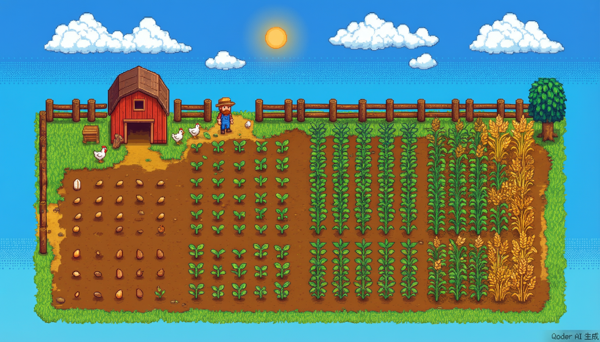
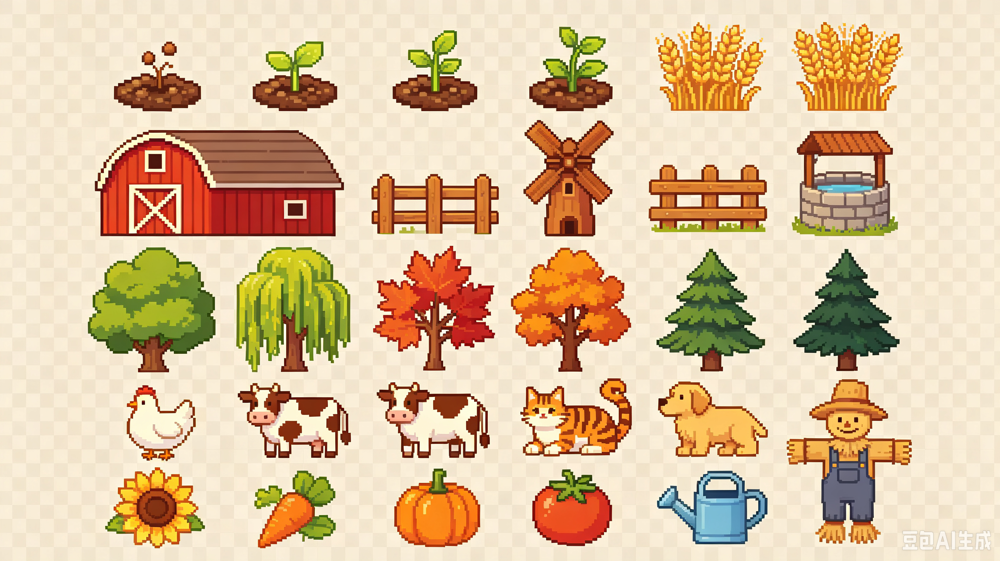

# GitHub Farm

[English](./README.md) | **中文**

> 把 GitHub 贡献数据变成一座星露谷风格的像素农场

[](https://opensource.org/licenses/MIT)
[](./CONTRIBUTING.md)
[](https://github.com/YeatsLiao/github-farm/stargazers)

> 🌱 **项目还在早期阶段，正在寻找贡献者！** 如果你觉得这个想法有意思，[给个 Star](https://github.com/YeatsLiao/github-farm)、[提个 Issue](https://github.com/YeatsLiao/github-farm/issues/new)、或者发个 PR —— 每一份帮助都很重要。查看 [CONTRIBUTING.md](./CONTRIBUTING.md) 了解如何参与。

## 这是什么？

GitHub Farm 把你的 GitHub 贡献数据可视化为**星露谷物语风格的像素农场**：

- **提交 = 作物** — 每周贡献按总量从低到高排序，从左到右生长：种子→嫩芽→成长→高秆→丰收
- **树木 = 语言** — 你最常用的编程语言变成草地上的树
- **动物 = PR** — 合并的 Pull Request 为农场带来动物
- **装饰 = Issue** — 参与 Issue 讨论为农场添加花朵和装饰

## 预览

**农场场景** — 作物从左到右依次生长：



**精灵图** — 作物、树木、动物、建筑和工具的像素风素材：



## 快速开始

### 本地开发

```bash
npm install
npm run dev      # 启动开发服务器（默认使用 mock 数据）
```

使用真实 GitHub 数据，配置 Token：

```bash
# Windows PowerShell
$env:GITHUB_TOKEN="ghp_your_token_here"; npm run dev

# macOS / Linux
GITHUB_TOKEN=ghp_your_token npm run dev
```

开发服务器会生成 PNG，启动本地 HTTP 服务（`http://localhost:3000`），并自动打开浏览器。修改代码后 Ctrl+C → `npm run dev` 刷新。

### 仅生成 PNG

```bash
npm run build          # mock 数据生成 → dist/farm.png
npm run build:real     # 真实数据生成（需要 GITHUB_TOKEN）
```

### 作为 GitHub Action

在你的 `username/username` 仓库添加 workflow：

```yaml
name: Generate Farm
on:
  schedule:
    - cron: '0 0 * * *'
  workflow_dispatch:
jobs:
  generate:
    runs-on: ubuntu-latest
    steps:
      - uses: YeatsLiao/github-farm@main
        with:
          github_token: ${{ secrets.GITHUB_TOKEN }}
          output: farm.png
          theme: stardew
```

## 数据映射

| GitHub 数据 | 农场元素 | 规则 |
|---|---|---|
| 周贡献量（排序分列） | 作物生长阶段 | 5 阶段：种子→嫩芽→成长→高秆→丰收 |
| Top 编程语言 | 树木 | 每种语言一棵，最多 5 棵 |
| 合并 PR 数 | 动物 | 每 8 个 PR 一只，最多 5 只 |
| Issue 参与数 | 装饰 | 每 6 个 Issue 一个，最多 4 个 |
| 连续提交 ≥ 30 天 | 稻草人 | 放在农田边缘 |

## 项目结构

```
github-farm/
├── src/
│   ├── index.js           # 主入口 + CLI
│   ├── fetcher.js         # GitHub GraphQL API + mock 数据
│   ├── renderer.js        # Canvas 像素风渲染引擎
│   ├── farm-layout.js     # 农场布局算法
│   └── themes/
│       └── stardew.js     # 星露谷主题配置
├── assets/
│   ├── sprites/cropped/   # 独立像素精灵（作物/树木/动物）
│   └── scenes/            # 背景图
├── dev-server.mjs         # 本地开发预览服务器
├── dist/                  # 构建输出（PNG）
├── docs/
│   ├── PRD.md             # 产品需求文档
│   ├── ARCHITECTURE.md    # 架构设计文档
│   └── DEVLOG.md          # 开发记录与踩坑
└── package.json
```

## 技术栈

- **Node.js** — 运行环境
- **Canvas**（npm `canvas`）— 像素风 PNG 渲染
- **GitHub GraphQL API** — 贡献数据获取
- **GitHub Actions** — 自动化（计划中）

## 开发路线

- [x] Canvas 像素风渲染引擎
- [x] 5 阶段作物系统 + 排序分列布局
- [x] 树木/动物/装饰 — 来自 GitHub 统计数据
- [x] 本地开发服务器 + 实时预览
- [ ] GitHub Action 封装
- [ ] 多主题支持（四季）
- [ ] 在线预览/配置工具

## 开发文档

| 文档 | 说明 |
|------|------|
| [PRD.md](./docs/PRD.md) | 产品需求文档 — 功能定义、用户场景、竞品分析 |
| [ARCHITECTURE.md](./docs/ARCHITECTURE.md) | 架构设计 — 模块设计、数据流、扩展点 |
| [DEVLOG.md](./docs/DEVLOG.md) | 开发记录 — 渲染引擎迭代、踩坑记录 |

## 许可证

MIT (c) YeatsLiao
